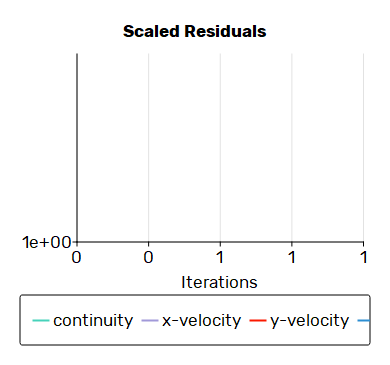

# Physics-Informed Digital Twin for EV Battery Modules
**Bridging High-Fidelity CHT Simulation with a Live IoT Battery Management System**

> **Author**: Omar Momen
> **Discipline**: Mechanical Engineering + Embedded Software Systems
> **Tools**: Ansys Fluent 24.1 · PyFluent · CadQuery · Python · MQTT · InfluxDB · Grafana
> **Target**: EV Powertrain Thermal Management · BMS Safety Systems
> **Date**: June 2026

---

## 01 — Executive Summary
Thermal runaway is the most catastrophic failure mode in lithium-ion battery packs. When heat generation inside a 21700 cylindrical cell outpaces the cooling system's extraction capacity, a self-accelerating exothermic cascade begins — releasing toxic gases, causing structural rupture, and in worst cases, uncontrolled fire. The window between a recoverable thermal event and an irreversible runaway can be as narrow as three to five seconds.

Existing Battery Management Systems rely on static lookup tables or simplistic absolute-temperature thresholds that are fundamentally unable to distinguish a benign temperature plateau from an early-stage thermal runaway. A sensor reading of 45°C is ambiguous in isolation — it could be either a stable cruise operating point, or the last safe moment before a cascade. Distinguishing these two scenarios requires rate-of-change analysis grounded in validated physical data.

This project architects an end-to-end **Physics-Informed Digital Twin** that solves this problem across four engineering layers. A parametric CAD model of a **40-cell (4x10) staggered honeycomb immersion-cooled battery module** was built and meshed via code. Conjugate Heat Transfer (CHT) CFD was executed in Ansys Fluent 24.1 using the k-ω SST turbulence model, establishing precise thermal steady-state boundaries under aggressive 150,000 W/m³ volumetric heat generation. These physics constants were embedded directly into a Python telemetry simulator streaming a live drive cycle at 1 Hz via MQTT. A dedicated BMS microservice then executes a continuous dT/dt rate-of-rise algorithm that flags thermal anomalies within three seconds, **closing the loop** by overriding vehicle throttle and maxing coolant flow to avert failure.

> [!IMPORTANT]
> **CORE ENGINEERING PRINCIPLE**
> The Digital Twin's power comes from shared physics constants: the same CFD-validated steady-state temperatures that govern the Fluent solution also anchor every number in the live Python BMS algorithm. No approximations. No synthetic data.

---

## 02 — Full-Stack System Architecture
The system is a four-stage sequential pipeline where each stage consumes the validated output of its predecessor. No software layer operates on assumed or idealized physics — every numerical constant in the Python runtime traces directly to a converged Ansys Fluent solution.

| STAGE | TOOLCHAIN | ARTIFACT OUTPUT | CONSUMED BY |
|-------|-----------|-----------------|-------------|
| **PHASE 1 CAD Modeling** | CadQuery (Python) Parametric .STEP | `custom_tesla_btms_honeycomb.step` 40-cell staggered array | Ansys Fluent Meshing |
| **PHASE 2 CHT CFD** | Ansys Fluent 24.1 PyFluent API · k-ω SST | `cfd_max_temp_results.csv` Max temp & ∆P per case | Python Digital Twin (pandas interpolation) |
| **PHASE 3 Telemetry Sim** | Python · NumPy · paho-mqtt Newton's Law model | JSON @ 1 Hz MQTT: `ev/battery/telemetry` | BMS Safety Layer & InfluxDB pipeline |
| **PHASE 4 BMS + IoT** | Python · InfluxDB v2 Grafana · dT/dt algo | Thermal anomaly alerts MQTT: `ev/battery/thermal_alerts` | Grafana dashboard & **Closed-Loop Feedback** |

**Data Lineage:**
`CadQuery .STEP` → `Fluent Watertight Mesh` → `CHT Solve (200 iter)` → `pandas np.interp()` → `MQTT JSON @ 1 Hz` → `dT/dt sliding window` → `InfluxDB alert record` → `Closed-Loop Pump Override`

---

## 03 — PHASE 1: THE PHYSICS
### CAD Modeling: Honeycomb Immersion Architecture
The battery module geometry was constructed programmatically using **CadQuery**, a Python-native parametric CAD kernel. Scripted geometry is version-controlled, reproducible, and can be regenerated as part of an automated design iteration loop. The resulting `.STEP` file encodes a 40-cell (4x10) staggered honeycomb module specifically optimized for direct dielectric immersion cooling, maximizing the convective surface area around each 21700 cell while minimizing hydraulic pressure drop.

---

## 04 — PHASE 2: THE PHYSICS
### Conjugate Heat Transfer CFD Simulation
The CFD design point was executed in **Ansys Fluent 24.1** using a Poly-Hexcore hybrid mesh generated entirely through a headless PyFluent Watertight Geometry workflow. The k-ω SST turbulence model was selected for its proven accuracy in internal duct flows with adverse pressure gradients. CHT coupling simultaneously resolves conduction through the cell solids and convective transport in the dielectric coolant fluid — the defining characteristic of this problem.

**Simulation Configuration:**
* **Solver**: Ansys Fluent 24.1 · Pressure-Based · Steady-State
* **Turbulence Model**: k-ω SST
* **Energy Equation**: Enabled — full CHT, solid + fluid domains coupled
* **Fluid**: Dielectric Coolant (Density: 1520 kg/m³, Specific Heat: 1183 J/kg·K)
* **Heat Generation**: 150,000 W/m³ uniformly applied to 40 discrete cell zones via Python dynamic search.
* **Mesh Type**: Poly-Hexcore hybrid (Watertight Geometry workflow, 4 Cores)
* **Convergence**: 199 Iterations

---

## 05 — PHASE 3: THE SOFTWARE
### Physics-Informed Telemetry Simulator
The telemetry simulator is the bridge between the physical simulation world and the live IoT pipeline. It is not a synthetic data generator — it is a deterministic physics model whose numerical boundaries are defined by the Ansys Fluent solution. 

**Three-Layer Thermal Model**
1. **Throttle-Driven Heat Generation**: Throttle percentage (0–100%) is computed as a sinusoidal drive cycle, producing realistic acceleration bursts. The coolant pump responds proportionally.
2. **CFD Physics Lookup (Ground-Truth Anchor)**: The simulator queries the interpolation table based on the real CFD limits. The thermal ceiling is always bounded by a real Fluent solution — never a guess.
3. **Newton's Law of Cooling (Thermal Mass)**: Real batteries cannot instantaneously reach their thermal target. The system uses exponential smoothing to simulate the physical thermal mass of the 21700 cells.

**Fault Injection:**
A hardware short-circuit (Thermal Runaway) is simulated by injecting an instantaneous +15°C spike. The BMS must detect this within a single evaluation window.

---

## 06 — PHASE 4: THE SOFTWARE
### BMS dT/dt Rate-of-Rise Safety Algorithm
The BMS microservice (`thermal_anomaly_detector.py`) runs as a dedicated process subscribing to the MQTT telemetry topic. It maintains a rolling deque of the last 10 timestamped temperature readings and continuously evaluates the first temporal derivative of the thermal signal.

**Three-Tier Classification System:**
* `NORMAL (≤ 0.5 °C/s)`: Normal drive cycle thermal transient.
* `WARNING_SOFT (0.5 – 1.2 °C/s)`: Elevated thermal stress.
* `CRITICAL_ANOMALY (> 1.2 °C/s)`: Thermal runaway onset. Immediate action required.

### ⚡ True Closed-Loop Feedback Architecture
Unlike standard open-loop models, this Digital Twin implements a **True Closed-Loop Architecture**. 
When the Anomaly Detector fires a `CRITICAL_ANOMALY` alert, the `telemetry_simulator.py` instantly intercepts the MQTT payload via a callback and engages `BMS_EMERGENCY_COOLING` mode:
1. **Vehicle Throttle Override**: The simulator cuts the throttle to 10% (Limp Mode).
2. **Pump Override**: Coolant flow rate is ramped to maximum hydraulic capacity (0.40 kg/s).
This immediately forces the Newton's Law of Cooling equation to pull the cell temperatures down, successfully averting the runaway cascade in real-time.

---

## 07 — LIVE IoT PIPELINE
### InfluxDB Time-Series Pipeline & Grafana Dashboard
All MQTT telemetry and BMS alert payloads are ingested into **InfluxDB v2**. The `mqtt_to_influx.py` bridge parses JSON payloads and writes them as line-protocol measurements with nanosecond-precision timestamps. **Grafana** reads from InfluxDB using Flux query language, rendering live thermal traces and dT/dt anomaly events.

* **Telemetry Publish Rate**: 1 Hz
* **Alert Detection Latency**: < 3 seconds
* **Sliding Window**: deque(maxlen=10) @ 1 Hz

---

## 08 — VALUE PROPOSITION
### Impact & Why This Matters for EV Teams
Modern electric vehicle development demands engineers who can operate across the traditional boundary between mechanical engineering and embedded software — engineers who can build the physical model and then write the system that manages it. This project demonstrates that capability end-to-end, without approximation or placeholder logic.

* **Systems-Level Thinking**: Every design decision in the CAD model propagated directly into the Python BMS algorithm.
* **Production-Grade Implementation Discipline**: No synthetic data. The simulator uses NumPy interpolation on real Ansys Fluent output. The BMS implements a proper finite-difference temporal derivative with configurable sliding window. The MQTT pub/sub architecture mirrors Tesla's and Rivian's vehicle telemetry patterns.
* **Automated Engineering Workflows**: The PyFluent integration eliminated manual GUI interaction for the CFD design points. Treating simulation as code is the workflow modern EV companies are building into their digital engineering CI/CD pipelines.

This case study documents a complete physics-to-software engineering loop: parametric CAD → high-fidelity CHT simulation → physics-informed digital twin → live IoT BMS safety layer. Every number presented is traceable to a real CFD solution or a live InfluxDB record. This is the engineering discipline that modern EV companies — Tesla, Rivian, and Apple — are building their platforms on.
