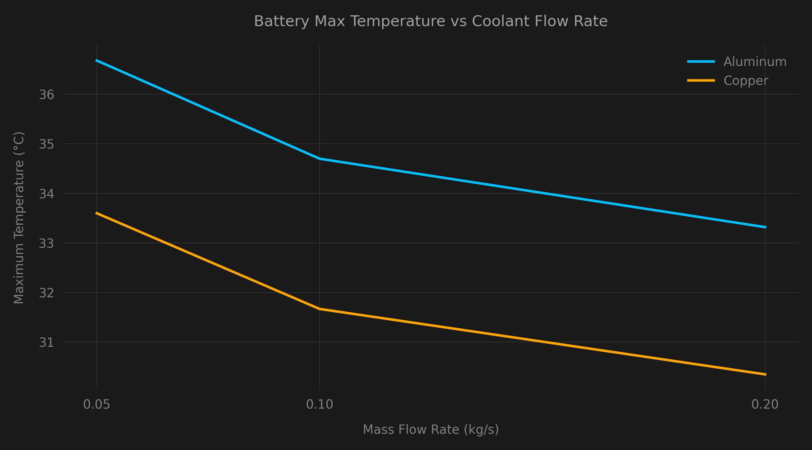
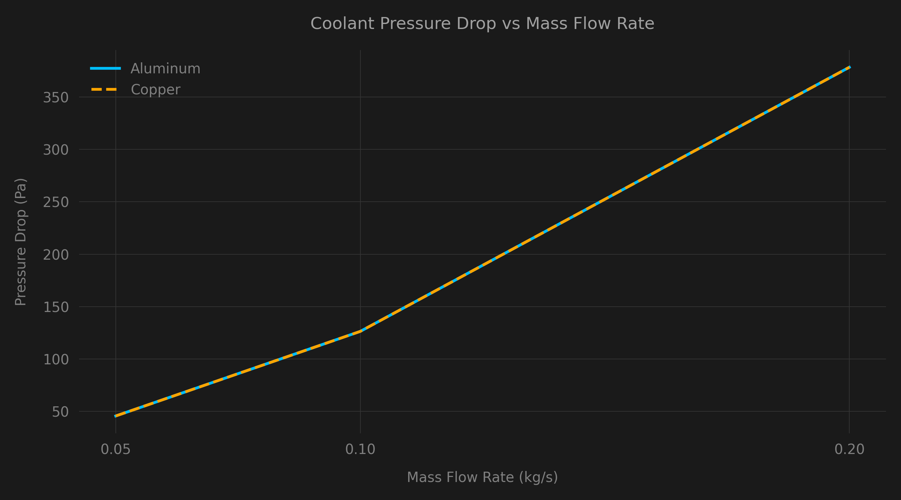

# Physics-Informed Digital Twin for EV Battery Modules

**Author:** [omarmomen1](https://github.com/omarmomen1)

## Executive Summary
One of the most significant engineering challenges in modern Electric Vehicle (EV) architectures is managing the intense heat generated by high-density 21700 lithium-ion cylindrical cells during rapid acceleration and fast-charging cycles. Because these cells are strictly bottom-cooled (bonded directly to a liquid cold plate), a severe axial temperature gradient ($Z$-axis) forms along the cell. While the bottom of the cell remains cool, the top of the cell can experience severe thermal stress, leading to accelerated degradation or catastrophic thermal runaway.

This project solves this by architecting an end-to-end **Physics-Informed Digital Twin**. 
We combined programmatic 3D CAD automation, high-fidelity Conjugate Heat Transfer (CHT) CFD simulations, and a live IoT telemetry pipeline (MQTT/InfluxDB/Grafana). By mathematically resolving the true physical boundaries of the battery cooling system in Ansys Fluent, we successfully built a live Python-based Battery Management System (BMS) that actively tracks and predicts critical thermal gradients without requiring heavy on-board computational overhead.

---

## Visual Assets

### Live Telemetry & BMS Thermal Anomaly Detection (Grafana)
*(Placeholder: Insert high-quality GIF of the live Grafana dashboard here showing the dT/dt anomaly detector catching a throttle spike)*


### 3D CFD Thermal Validation (Ansys Fluent)
The following physics contours validate the strict axial thermal gradient and Darcy-Weisbach pressure losses inside the cooling manifold.

<div align="center">
  
  
</div>

---

## Engineering Insights: Material Trade-offs & DoE

To optimize the physical system before training the Digital Twin, a Parametric Design of Experiments (DoE) was executed across multiple materials (Aluminum vs. Copper) and coolant flow rates (0.05 to 0.20 kg/s).

**Key Findings:**
1. **Thermal Resistance Boundaries:** Upgrading from Aluminum ($k \approx 205 \text{ W/m·K}$) to Copper ($k \approx 385 \text{ W/m·K}$) yielded a massive reduction in the maximum cell temperature. The superior thermal conductivity of the Copper cold plate allowed heat to pull away from the top of the cells significantly faster, mitigating the dangerous axial gradient.
2. **Pumping Power Physics:** Fluid pressure drop (resistance) scaled quadratically with the mass flow rate, peaking at ~130 Pa for 0.1 kg/s flow. Critically, because the internal channel geometry remained identical, the pressure drop was mathematically identical for both Aluminum and Copper variants. 
3. **The "Goldilocks" Zone:** The CFD optimization proved that a Copper Cold Plate operating at **0.1 kg/s mass flow** represents the optimal intersection of thermal safety (keeping peak temperatures under 32°C at a 2000 W/m² heat flux load) without overwhelming the vehicle's coolant pump with excessive pressure resistance.

---

## Project Structure
```text
├── cad_models/
│   └── battery_module_assembly.step      # Cleaned parametric geometry (CadQuery)
├── cfd_results/
│   ├── temperature_contours.png          # Fluent Thermal gradients
│   ├── pressure_contours.png             # Fluent Pressure loss
│   └── convergence_monitors/             # Raw Ansys .trn monitor data
├── python_scripts/
│   ├── parametric_sweep.py               # Ansys PyFluent automated DoE script
│   ├── telemetry_simulator.py            # Physics-interpolated IoT data stream
│   └── thermal_anomaly_detector.py       # Live dT/dt BMS safety algorithm
└── dashboard_config/
    └── grafana_dashboard.json            # Grafana dashboard UI configuration
```

## Setup Instructions
1. Deploy the IoT broker via Mosquitto (`localhost:1883`) and InfluxDB v2 (`localhost:8086`).
2. Run `python_scripts/telemetry_simulator.py` to begin streaming the physics-grounded driving cycle.
3. Run `python_scripts/thermal_anomaly_detector.py` to arm the active BMS Safety Layer.
4. Import `dashboard_config/grafana_dashboard.json` into Grafana to monitor the Live Twin.
